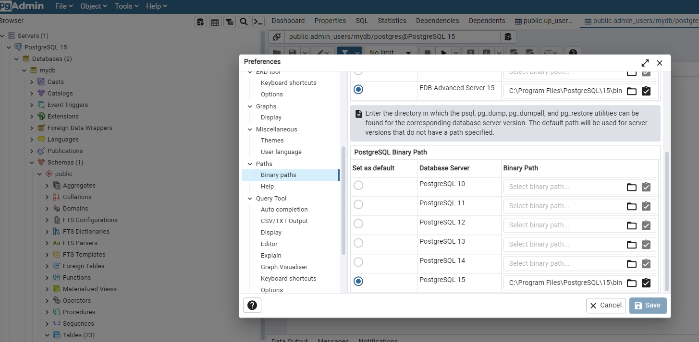

## How to start
To start service postgres:
```
docker-compose up -d
```

To start source nextjs:
```
cd frontend
yarn install

(For fist time)
yarn run db:setup

yarn dev
```
## strapi admin info
user superadmin@gmail.com
pass Abc@123456

## how to backup and restore db
config path binary to enable backup/restore

click check box of PostgreSQL 15
### backup
right click db `mydb` -> backup -> filenam: `mydb.sql`, format: plain, Encoding: UTF8 -> tab `options` switch on: use insert commands

### restore
create db `mydb` -> right click `Query tool` -> paste content of file `db/mydb.sql` then run